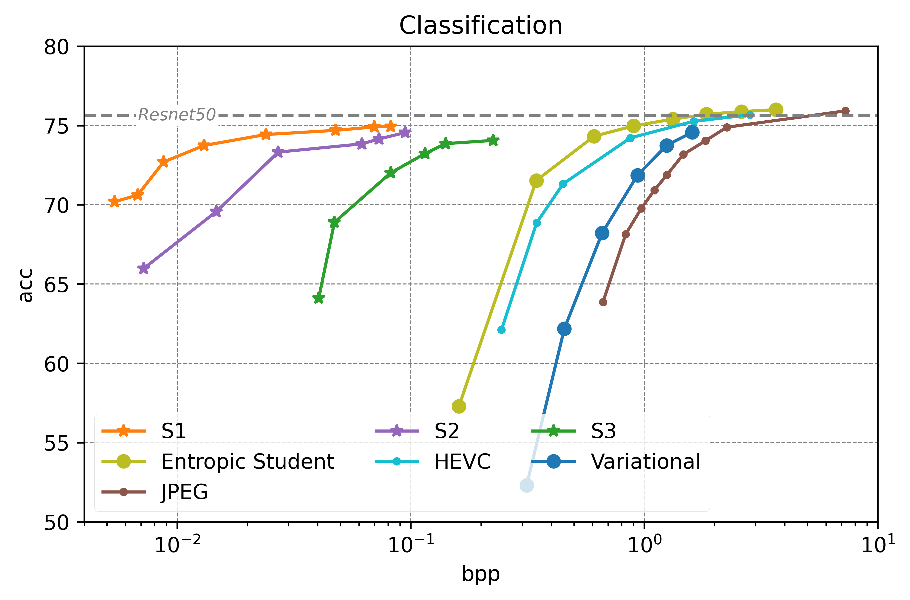
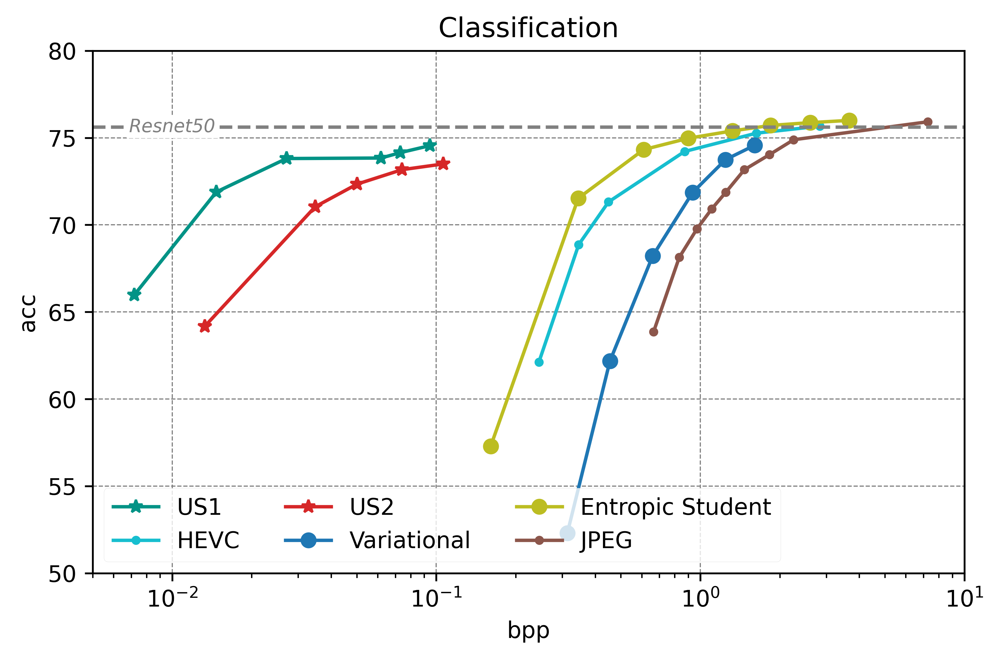
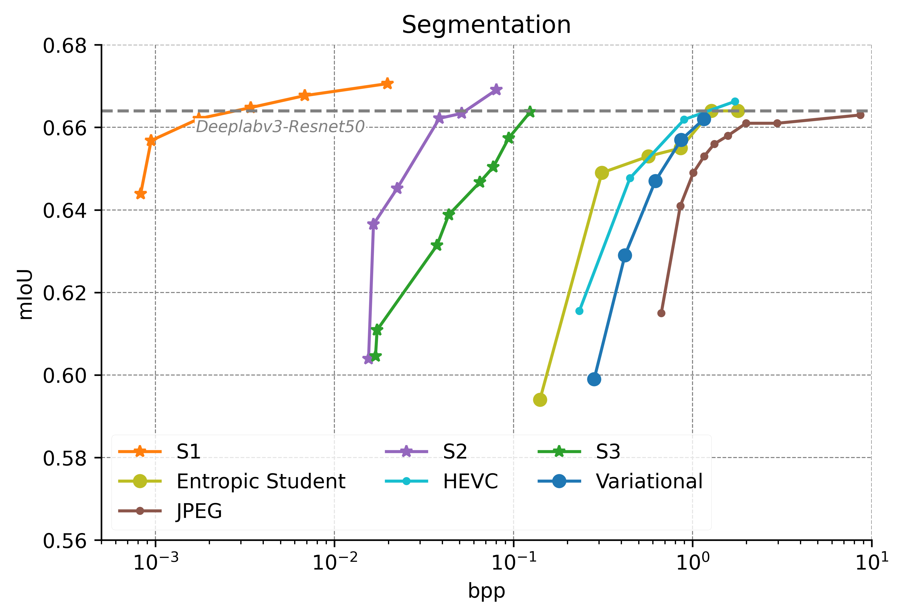
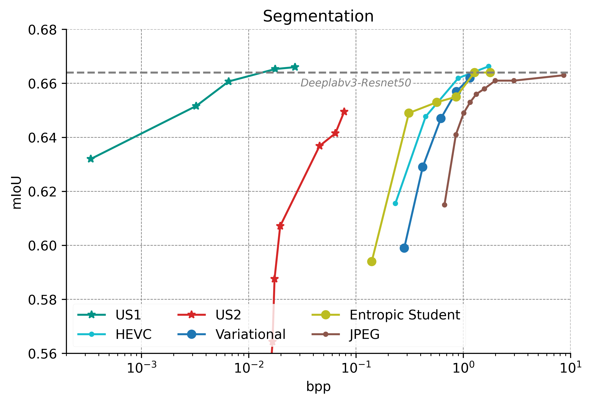

# Semantic Preserving Image Compression

This repository serves as the companion to our CVPR 2023 paper titled "Neural Rate Estimator and Unsupervised Learning for Efficient Distributed Image Analytics in Split-DNN models". In this work, we present a method to train split-DNN models for distributed, rate-distrotion optimized visual-analytics. A deep neural network is partitioned into a client-side front-end and a server-side back-end. Intermediate representations from the front-end are compressed and transmitted to the back-end where. Specially trained low-complexity neural networks called 'bottleneck units' -- comprising an encoder at the front-end and a corresponding decoder at the back-end -- are inserted at the split point. These help transform the high-dimensional intermediate features into a low-dimensional representations. The bottleneck layers are trained to jointly optimize for compression and task performance.

The code in this repo will reproduce results for our method. To generate HEVC results, we used the libx265 encoder in [FFMPEG](http://trac.ffmpeg.org/wiki/Encode/H.265). To generate results for other baselines used in the paper, please refer to the paper by Matsubara, Yoshitomo, et al titled "Supervised compression for resource-constrained edge computing systems." in WACV 2022, and their corresponding [github page](https://github.com/yoshitomo-matsubara/supervised-compression)


## Results

Our method outperforms state-of-the-art methods on both for image classification and semantic segmentation.

<p align="center">


<p>
<p align="center">


<p>

## Create Virtual Environment:

```
sudo apt-get update
sudo apt-get install python3-virtualenv 
virtualenv -p /usr/bin/python3 virtualenvironment 
source virtualenvironment/bin/activate
cd CVPR_OPEN_SOURCE
python -m pip install -r requirement.txt
```

## Dependencies

Following modules are needed and can be installed using requirement.txt: 

- torch (>=1.10.0)
- torchvision (>=0.11.1)
- tqdm
- scipy 
- pycocotools
- omegaconf
- numpy

## Dataset

### Segmentation:
Download the coco dataset from -

- 2017 Val images[5K/1GB] : http://images.cocodataset.org/zips/val2017.zip
- 2017 Train/Val annotations[241MB] : http://images.cocodataset.org/annotations/annotations_trainval2017.zip

### Classification:

Download the Imagenet dataset from: https://www.image-net.org/download.php 

## Running the code 

```
usage: val.py [--valdir] [--batch_size] [--gpu] [--split_point] [--compress_factor] 

arguments:
  
  --valdir     The path to the val dataset
  --batch_size Batch Size
  --gpu        (True/False) Whether to run on GPU or CPU
  --split_point (S1/S2/S3/US1/US2) 
  --compress_factor Choose compression configuration from dict.yaml file

example:
  cd [Segmentation/Classification]
  python3 val.py --gpu True --batch_size 20 --split_point S1 --compress_factor 1

* Freq_tab folder contains frequency table corresponding to each model
* Weights folder contains model weights for different configurations at different split points
* Model folder contains architecture for three split points
*Dict.yaml contains the configuration for each point on the rate distortion curve for different split points

```

## Split Point within the model:
| Split Point | Classification | Segmentation |
| --- | --- | --- | 
| S1/US1 | layer4[2] | Classifier[0].conv[1] |
| S2/US2 | layer4[0] | Resnet50.layer4[1] |
| S3 | layer3[4] | Resnet50.layer3[5] |
  
 ## Reference
 The results in this repo are based on the following two papers:
 
 ```tex
@inproceedings{ahuja2023neural,
  title={Neural Rate Estimator and Unsupervised Learning for Efficient Distributed Image Analytics in Split-DNN Models},
  author={Ahuja, Nilesh and Datta, Parual and Kanzariya, Bhavya and Somayazulu, V Srinivasa and Tickoo, Omesh},
  booktitle={Proceedings of the IEEE/CVF Conference on Computer Vision and Pattern Recognition},
  pages={2022--2030},
  year={2023}
}
 ```
 and
 ```
 @inproceedings{datta2022low,
  title={A Low-Complexity Approach to Rate-Distortion Optimized Variable Bit-Rate Compression for Split DNN Computing},
  author={Datta, Parual and Ahuja, Nilesh and Somayazulu, V Srinivasa and Tickoo, Omesh},
  booktitle={2022 26th International Conference on Pattern Recognition (ICPR)},
  pages={182--188},
  year={2022},
  organization={IEEE}
}
```

